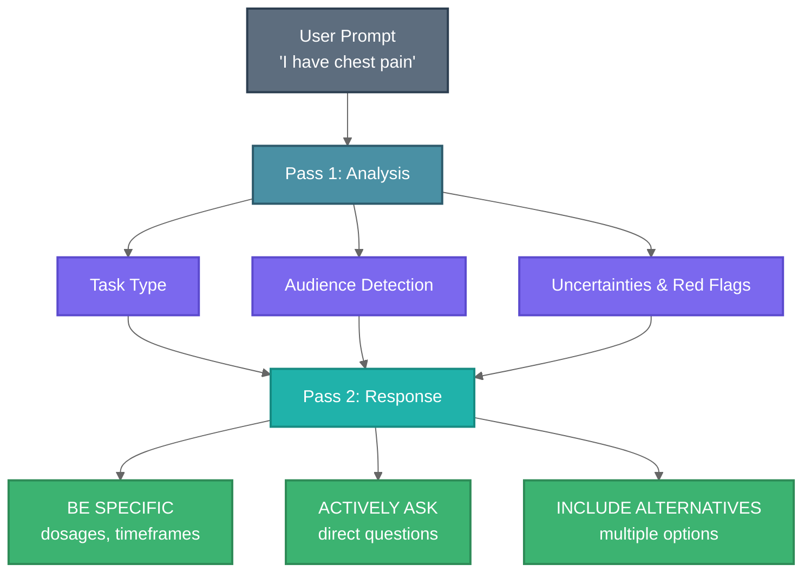

<div align="center">

# BODHI

**Epistemic virtues for LLMs**

*Curiosity. Humility. Clarity.*

[](https://pypi.org/project/bodhi-llm/)
[](https://www.python.org/downloads/)
[](https://creativecommons.org/licenses/by-nc-sa/4.0/)

[](https://journals.plos.org/digitalhealth/article?id=10.1371/journal.pdig.0001013)
[](https://www.thelancet.com/journals/lancet/article/PIIS0140-6736(25)01626-5/fulltext)

</div>

---

**BODHI** (Bridging, Open, Discerning, Humble, Inquiring) is a lightweight Python library that wraps any LLM to produce responses that are genuinely curious, appropriately humble, and clinically specific.

```python
pip install bodhi-llm
```

---

## The Problem

LLMs tend to be **overconfident**, give **vague advice**, and **assume** rather than **ask**.

## The Solution

BODHI uses a two-pass prompting strategy that teaches LLMs to:

| | Baseline LLM | With BODHI |
|---|---|---|
| **Confidence** | Overconfident | Appropriately humble |
| **Missing info** | Makes assumptions | Asks clarifying questions |
| **Advice** | Vague ("see a doctor") | Specific (dosages, timeframes) |
| **Safety** | May miss red flags | Explicitly identifies red flags |

---

## Quick Start

```python
from bodhi import BODHI
from openai import OpenAI

client = OpenAI()
bodhi = BODHI.from_openai(client, model="gpt-4o-mini")

response = bodhi.complete("I have chest pain")
print(response.content)
```

**Output characteristics:**
- Asks: *"Are you experiencing shortness of breath right now?"*
- Specific: *"Take aspirin 325mg if not allergic"*
- Clear: *"Call 911 immediately if pain spreads to arm or jaw"*

---

## Installation

```bash
# Basic
pip install bodhi-llm

# With OpenAI
pip install bodhi-llm[openai]

# All providers
pip install bodhi-llm[all]
```

---

## How It Works



### Task Routing

| Task Type | Behavior |
|-----------|----------|
| `CONVERSATION` | Warm, helpful with clarifying questions |
| `TECHNICAL` | Strict format (SOAP notes, ICD codes) |
| `HYBRID` | Technical format + clinical reasoning |
| `EMERGENCY` | Clear, step-by-step guidance |

---

## Usage

### With Any LLM

```python
from bodhi import BODHI

def my_llm(messages):
    # Your LLM call here
    return "response"

bodhi = BODHI(my_llm)
response = bodhi.complete("I have a headache")
```

### Configuration

```python
from bodhi import BODHI, BODHIConfig

config = BODHIConfig(
    domain="medical",  # or "general"
)

bodhi = BODHI(chat, config=config)
```

### Analysis Only

```python
# Inspect the reasoning without generating response
analysis = bodhi.analyze("I have chest pain")
print(analysis)
```

---

## API

### `BODHI`

```python
BODHI(chat_function, config=None)
BODHI.from_openai(client, model="gpt-4o-mini")
```

**Methods:**
- `complete(prompt)` → `BODHIResponse`
- `analyze(prompt)` → `str`

### `BODHIResponse`

```python
response.content   # Final response text
response.analysis  # Pass 1 reasoning
response.metadata  # Timing, domain info
```

---

## Citation

```bibtex
@article{cajas2026beyond,
  title={Beyond overconfidence: Embedding curiosity and humility for ethical medical AI},
  author={Cajas Ordóñez, Sebastián Andrés and Ocampo Osorio, Felipe and Lange, Maximin and Celi, Leo Anthony and others},
  journal={PLOS Digital Health},
  year={2026},
  doi={10.1371/journal.pdig.0001013}
}
```

<details>
<summary>Additional citations</summary>

```bibtex
@article{ordonez2025humility,
  title={Humility and curiosity in human--AI systems for health care},
  author={Ordoñez, Sebastián Andrés Cajas and Lange, Maximin and Lunde, Torleif Markussen and Meni, Mackenzie J and Premo, Anna E},
  journal={The Lancet},
  volume={406},
  number={10505},
  year={2025}
}
```

</details>

---

## Contributing

BODHI is built by an interdisciplinary team of **philosophers, clinicians, engineers, and scientists** spanning generations and continents. We welcome contributions from anyone passionate about making AI more humble and curious.

### Future Directions

- **Anti-sycophancy** — Resist agreeing just to please
- **Critical thinking** — Challenge assumptions constructively
- **Cultural sensitivity** — Adapt to cultural contexts
- **Epistemic justice** — Recognize diverse ways of knowing

**Interested?** Reach out: **sebasmos@mit.edu**

---

## Links

[PyPI](https://pypi.org/project/bodhi-llm/) · [PLOS Digital Health](https://journals.plos.org/digitalhealth/article?id=10.1371/journal.pdig.0001013) · [The Lancet](https://www.thelancet.com/journals/lancet/article/PIIS0140-6736(25)01626-5/fulltext) · [HumbleAILLMs](https://github.com/sebasmos/HumbleAILLMs)

---

<div align="center">

**CC BY-NC-SA 4.0** · Made with curiosity and humility

</div>
